# Parasol Insurance - System Architecture Documentation

## Table of Contents
- [System Overview](#system-overview)
- [Architecture Diagram](#architecture-diagram)
- [Component Architecture](#component-architecture)
- [Data Flow](#data-flow)
- [Technology Stack](#technology-stack)
- [Container Architecture](#container-architecture)
- [API Endpoints](#api-endpoints)
- [Database Schema](#database-schema)
- [AI Integration](#ai-integration)
- [Security Considerations](#security-considerations)
- [Performance & Scalability](#performance--scalability)
- [Deployment Architecture](#deployment-architecture)

## System Overview

The Parasol Insurance application is a modern, containerized full-stack solution for managing insurance claims with AI-powered chatbot assistance. The system provides a web-based interface for claim management and real-time AI-driven query processing using large language models.

### Key Features
- **Claim Management**: View, search, and manage insurance claims
- **AI Chatbot**: Real-time chat assistance using Llama 3.1 model
- **Real-time Communication**: WebSocket-based chat functionality  
- **Modern UI**: React-based frontend with PatternFly components
- **Containerized Deployment**: Docker-based architecture for easy deployment
- **Local AI**: Self-hosted AI model for data privacy

## Architecture Diagram

```mermaid
graph TB
    %% External Layer
    User[👤 User Browser]
    
    %% Load Balancer / Reverse Proxy Layer
    subgraph "External Access"
        LB[🌐 Load Balancer<br/>Port 8005]
    end
    
    %% Frontend Layer
    subgraph "Frontend Layer"
        React[⚛️ React App<br/>PatternFly UI<br/>Static Files]
    end
    
    %% Application Layer
    subgraph "Application Layer"
        subgraph "parasol-app Container"
            API[🚀 Fastify Server<br/>Node.js Backend<br/>Port 8005]
            WS[🔌 WebSocket Server<br/>Real-time Chat]
            Routes[📋 Route Handlers<br/>Claims API]
            Plugins[🔧 Fastify Plugins<br/>DB Connector]
        end
    end
    
    %% Data Layer
    subgraph "Data Layer"
        subgraph "parasol-app Container"
            SQLite[(🗄️ SQLite Database<br/>In-Memory<br/>Claims Data)]
        end
    end
    
    %% AI Layer
    subgraph "AI Layer"
        subgraph "parasol-ollama Container"
            Ollama[🤖 Ollama Server<br/>Port 11434]
            LLM[🧠 Llama 3.1 Model<br/>8B Parameters<br/>4GB Size]
        end
    end
    
    %% Docker Infrastructure
    subgraph "Docker Infrastructure"
        Network[🐳 Docker Network<br/>parasol-network]
        Volumes[💾 Docker Volumes<br/>ollama_data]
        Compose[📦 Docker Compose<br/>Orchestration]
    end
    
    %% Connections
    User --> LB
    LB --> React
    React --> API
    API --> WS
    API --> Routes
    Routes --> Plugins
    Plugins --> SQLite
    API <--> Ollama
    WS <--> Ollama
    Ollama --> LLM
    
    %% Docker connections
    API -.-> Network
    Ollama -.-> Network
    Ollama -.-> Volumes
    Compose -.-> API
    Compose -.-> Ollama
```



## Component Architecture

### 1. Frontend Layer

**React Application (SPA)**
- **Framework**: React 18 with TypeScript
- **UI Library**: PatternFly (Red Hat Design System)
- **Build Tool**: Webpack 5 with optimizations
- **Routing**: React Router for SPA navigation
- **State Management**: React hooks and context

**Key Components:**
```
src/
├── app/
│   ├── components/
│   │   ├── AppLayout/          # Main application layout
│   │   ├── Chat/               # AI chatbot interface
│   │   ├── ClaimDetail/        # Individual claim viewer
│   │   ├── ClaimsList/         # Claims listing component
│   │   └── ImageCarousel/      # Image gallery for claims
│   ├── assets/                 # Static assets and images
│   └── utils/                  # Utility functions
```

### 2. Backend Layer

**Fastify Server**
- **Runtime**: Node.js 18+ with ES modules
- **Framework**: Fastify (high-performance HTTP server)
- **WebSocket**: @fastify/websocket for real-time communication
- **Static Serving**: @fastify/static for React app delivery

**Architecture Pattern:**
```
app/
├── server.mjs              # Main application server
├── routes/
│   ├── claims-route.mjs    # REST API for claims
│   └── chatbot-ws-route.mjs # WebSocket chat handler
├── plugins/
│   └── db/
│       └── sqlite-connector.mjs # Database plugin
└── ai/
    ├── ai.mjs              # AI service integration
    └── chatbot.mjs         # Chatbot logic
```

### 3. Data Layer

**SQLite Database**
- **Type**: In-memory SQLite database
- **Initialization**: SQL file-based data seeding
- **Connection**: Custom Fastify plugin
- **Data**: Pre-loaded with 6 sample insurance claims

### 4. AI Layer

**Ollama Integration**
- **Service**: Ollama server for LLM hosting
- **Model**: Llama 3.1 (8B parameters, Q4_K_M quantization)
- **API**: OpenAI-compatible REST API
- **Integration**: LangChain for advanced AI workflows

## Data Flow

### 1. User Request Flow


### 2. AI Chat Flow


### 3. Real-time Communication


## Technology Stack

### Frontend Technologies
| Component | Technology | Version | Purpose |
|-----------|------------|---------|---------|
| **Framework** | React | 18.x | UI framework |
| **UI Library** | PatternFly | 5.x | Design system |
| **Language** | TypeScript | 5.x | Type safety |
| **Build Tool** | Webpack | 5.x | Module bundling |
| **Testing** | Jest | 29.x | Unit testing |
| **Linting** | ESLint | 8.x | Code quality |

### Backend Technologies
| Component | Technology | Version | Purpose |
|-----------|------------|---------|---------|
| **Runtime** | Node.js | 18+ | JavaScript runtime |
| **Framework** | Fastify | 4.x | HTTP server |
| **Database** | SQLite | 5.x | Data persistence |
| **AI Integration** | LangChain | 0.3.x | AI workflows |
| **WebSocket** | @fastify/websocket | 10.x | Real-time communication |

### AI & ML Stack
| Component | Technology | Version | Purpose |
|-----------|------------|---------|---------|
| **AI Server** | Ollama | Latest | LLM hosting |
| **Model** | Llama 3.1 | 8B | Language model |
| **API** | OpenAI Compatible | - | Standard interface |
| **Quantization** | Q4_K_M | - | Model optimization |

### Infrastructure
| Component | Technology | Version | Purpose |
|-----------|------------|---------|---------|
| **Containerization** | Docker | Latest | Application packaging |
| **Orchestration** | Docker Compose | Latest | Multi-container management |
| **Networking** | Docker Networks | - | Inter-container communication |
| **Storage** | Docker Volumes | - | Persistent data |

## Container Architecture

### Container Overview
```yaml
Services:
  parasol-app:
    - Purpose: Main application server
    - Base: node:18-alpine  
    - Ports: 8005:8005
    - Health Check: HTTP GET /
    
  parasol-ollama:
    - Purpose: AI model server
    - Base: ollama/ollama:latest
    - Ports: 11434:11434  
    - Health Check: ollama list
    
  parasol-model-setup:
    - Purpose: Model download (init container)
    - Base: curlimages/curl:latest
    - Lifecycle: Run once and exit
```

### Multi-stage Build Process
```dockerfile
# Stage 1: Frontend Build
FROM node:18-alpine AS frontend-build
WORKDIR /app/webui
COPY webui/package*.json ./
RUN npm ci
COPY webui/ ./
RUN npm run build

# Stage 2: Production
FROM node:18-alpine
WORKDIR /app
COPY package*.json ./
RUN npm ci --only=production
COPY . .
COPY --from=frontend-build /app/webui/dist ./webui/dist
USER parasol
CMD ["node", "server.mjs"]
```

## API Endpoints

### REST API Endpoints

| Method | Endpoint | Description | Response |
|--------|----------|-------------|----------|
| `GET` | `/` | Serve React application | HTML |
| `GET` | `/api/db/claims` | List all claims | JSON Array |
| `GET` | `/api/db/claims/:id` | Get specific claim | JSON Object |
| `WS` | `/chatbot` | WebSocket chat endpoint | Real-time |

### API Response Examples

**GET /api/db/claims**
```json
[
  {
    "id": 1,
    "claim_number": "CLM195501",
    "category": "Multiple vehicle",
    "policy_number": "AC-987654321",
    "client_name": "Marty McFly",
    "email_address": "marty.mcfly@email.com",
    "subject": "Claim for Recent Car Accident",
    "body": "...",
    "summary": "...",
    "location": "Hill Valley",
    "claim_time": "January 2nd, 1955",
    "sentiment": "Professional and cooperative",
    "status": "In Process"
  }
]
```

**WebSocket Chat Message**
```json
{
  "type": "user_message",
  "message": "What happened in claim CLM195501?",
  "claim_context": {
    "id": 1,
    "claim_number": "CLM195501",
    "summary": "DeLorean accident in Hill Valley..."
  }
}
```

## Database Schema

### Claims Table Schema
```sql
CREATE TABLE claim(
  id INTEGER PRIMARY KEY,
  claim_number TEXT NOT NULL,
  category TEXT NOT NULL,
  policy_number TEXT NOT NULL,
  inception_date DATETIME NOT NULL,
  client_name TEXT NOT NULL,
  email_address TEXT NOT NULL,
  subject TEXT NOT NULL,
  body TEXT NOT NULL,
  summary TEXT NOT NULL,
  location TEXT NOT NULL,
  claim_time TEXT NOT NULL,
  sentiment TEXT NOT NULL,
  status TEXT NOT NULL
);
```

### Sample Data Categories
- **Claim Types**: Single vehicle, Multiple vehicle
- **Status Values**: New, In Process, Processed, Denied
- **Sentiment Analysis**: Professional, Frustrated, Anxious, Confident

## AI Integration

### Ollama Architecture


### AI Model Specifications
- **Model**: Llama 3.1 (8 billion parameters)
- **Quantization**: Q4_K_M (4-bit quantization)
- **Size**: ~4GB on disk
- **Context Length**: 4,096 tokens
- **Temperature**: 0.3 (focused responses)
- **API**: OpenAI-compatible interface

### Chat Context Management
```javascript
// Example context building for AI queries
const buildChatContext = (claim, userMessage) => {
  return `
Insurance Claim Context:
- Claim Number: ${claim.claim_number}
- Client: ${claim.client_name}
- Summary: ${claim.summary}
- Location: ${claim.location}
- Status: ${claim.status}

User Question: ${userMessage}

Please provide a helpful response based on the claim information above.
`;
};
```

## Security Considerations

### Container Security
- **Non-root user**: Application runs as `parasol` user (UID 1001)
- **Minimal base images**: Alpine Linux for smaller attack surface
- **Health checks**: Proactive monitoring of service health
- **Network isolation**: Docker networks for inter-container communication

### Application Security
- **Input validation**: All API inputs validated
- **CORS protection**: Configurable cross-origin policies
- **Static file serving**: Secure static file delivery
- **Environment variables**: Sensitive configuration externalized

### Data Security
- **In-memory database**: No persistent sensitive data storage
- **Local AI processing**: No data sent to external AI services
- **Sample data only**: No real customer information

## Performance & Scalability

### Performance Optimizations

**Frontend**
- Webpack bundle splitting and optimization
- Static asset caching with proper headers
- Component lazy loading where appropriate
- PatternFly optimized component library

**Backend**  
- Fastify high-performance HTTP server
- In-memory SQLite for fast data access
- WebSocket connection pooling
- Efficient JSON serialization

**AI Processing**
- Local model inference (no network latency)
- Q4_K_M quantization for optimal size/quality balance
- Temperature tuning for focused responses
- Context window optimization

### Scalability Considerations

**Horizontal Scaling**
- Stateless application design
- Container-ready architecture
- Load balancer compatible
- Separate data and AI services

**Vertical Scaling**
- Configurable AI model parameters
- Memory-efficient SQLite usage
- Node.js event loop optimization
- Docker resource limits

## Deployment Architecture

### Development Environment
```bash
# Quick start
git clone <repository>
cd parasol-insurance-nodejs
./scripts/setup.sh
```

### Production Deployment Options

**Docker Compose (Single Host)**
```yaml
# Suitable for: Development, small deployments
# Resources: 8GB RAM, 20GB disk
# Scaling: Vertical only
```

**Kubernetes (Cluster)**
```yaml
# Suitable for: Production, high availability
# Resources: Multi-node cluster
# Scaling: Horizontal + Vertical
```

**Cloud Container Services**
```yaml
# Options: AWS ECS, Azure Container Instances, Google Cloud Run
# Benefits: Managed infrastructure, auto-scaling
# Considerations: Model size, cold starts
```

### Resource Requirements

**Minimum Requirements**
- **CPU**: 4 cores
- **Memory**: 8GB RAM
- **Storage**: 10GB disk space
- **Network**: 1Gbps for model download

**Recommended Production**
- **CPU**: 8+ cores  
- **Memory**: 16GB+ RAM
- **Storage**: 50GB+ SSD
- **Network**: High-bandwidth connection

### Monitoring & Observability

**Application Metrics**
- HTTP request/response times
- WebSocket connection counts  
- Database query performance
- AI model inference times

**Infrastructure Metrics**
- Container resource usage
- Docker health check status
- Network connectivity
- Disk usage and I/O

**Logging Strategy**
- Structured JSON logging (Fastify built-in)
- Container log aggregation
- Error tracking and alerting
- Performance monitoring

---

## Quick Reference

### Key URLs
- **Application**: http://localhost:8005
- **API**: http://localhost:8005/api/db/claims
- **AI Service**: http://localhost:11434
- **Health Checks**: Built into containers

### Commands
```bash
# Start services
docker-compose up -d

# View logs  
docker-compose logs -f

# Test system
./test-system.sh

# Stop services
docker-compose down
```

### Configuration Files
- `docker-compose.yml` - Service orchestration
- `Dockerfile` - Application container
- `.env` - Environment variables
- `CLAUDE.md` - Development guidance
- `README-SETUP.md` - Setup instructions

This architecture provides a robust, scalable foundation for AI-powered insurance claim management with modern development practices and containerized deployment.